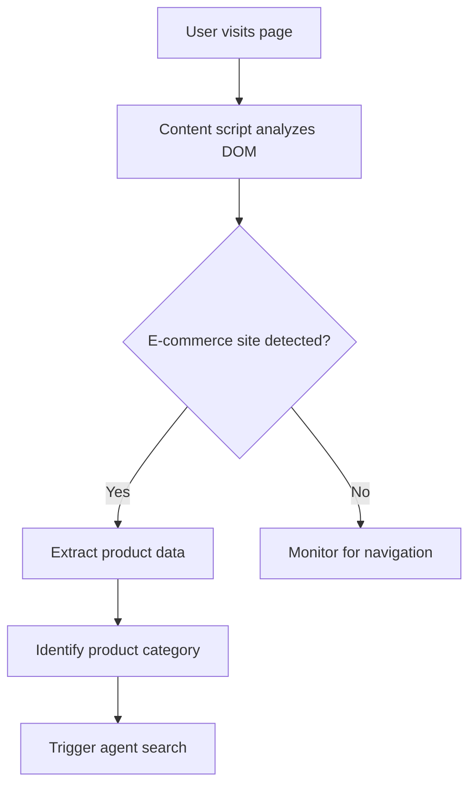
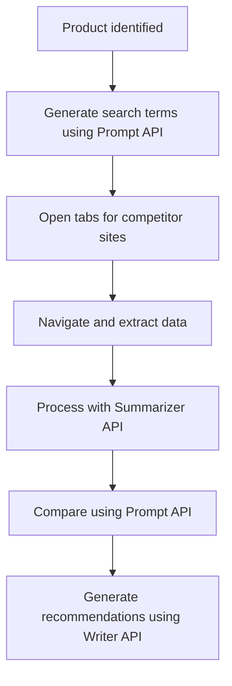
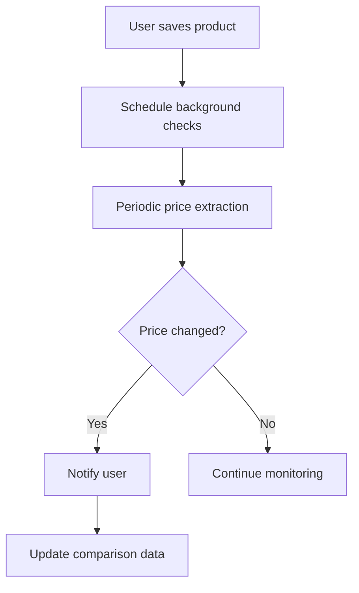

# Agent-Powered PromptBridge Architecture

## Overview

Agent-Powered PromptBridge is an intelligent Chrome extension that combines browser automation capabilities with Chrome's Built-in AI APIs to create an autonomous e-commerce product analysis system. The extension automatically navigates product pages, extracts relevant data, and provides intelligent insights using local AI processing.

## Core Concept

PromptBridge acts as an autonomous shopping assistant that:
1. **Detects** when users are viewing product pages
2. **Automatically extracts** product information (title, price, specs, reviews)
3. **Intelligently searches** for similar products across multiple sites
4. **Processes data** using Chrome's Built-in AI APIs
5. **Presents insights** in a clean, actionable interface

## System Architecture

### 1. Agent Layer (Browser Automation)

#### Components:
- **Page Detector**: Identifies e-commerce product pages
- **Data Extractor**: Extracts structured product data from DOM
- **Site Navigator**: Autonomously visits competitor sites
- **Cross-Site Crawler**: Gathers comparative product data

#### Technologies:
- Chrome DevTools Protocol
- Content Scripts for DOM manipulation
- Background Service Worker for coordination
- Chrome Tabs API for multi-site navigation

### 2. AI Processing Layer (Built-in APIs)

#### Chrome Built-in AI API Integration:

**Prompt API** (Primary)
- Generate structured product comparisons
- Create personalized shopping recommendations
- Process multimodal data (product images + text)
- Generate search queries for competitor products

**Summarizer API**
- Condense lengthy product descriptions
- Summarize multiple customer reviews
- Extract key product features from specifications

**Translator API**
- Handle international e-commerce sites
- Translate product descriptions and reviews
- Support global price comparison

**Writer API**
- Generate product comparison reports
- Create personalized buying guides
- Write shopping recommendations

**Rewriter API**
- Improve clarity of extracted product specs
- Standardize product descriptions across sites
- Enhance readability of technical specifications

### 3. Data Layer

#### Data Flow:
```
Product Page Detection → Data Extraction → AI Processing → User Interface
```

#### Data Structures:
```typescript
interface ProductData {
  title: string;
  price: {
    amount: number;
    currency: string;
    discounted?: number;
  };
  specifications: Record<string, string>;
  reviews: {
    rating: number;
    count: number;
    highlights: string[];
  };
  images: string[];
  availability: string;
  shipping: {
    cost?: number;
    timeframe: string;
  };
  source: {
    site: string;
    url: string;
    timestamp: Date;
  };
}

interface ComparisonResult {
  products: ProductData[];
  analysis: {
    bestValue: string;
    pros: string[];
    cons: string[];
    recommendation: string;
  };
  priceHistory?: PricePoint[];
}
```

### 4. User Interface Layer

#### Components:
- **Floating Widget**: Non-intrusive overlay on product pages
- **Comparison Panel**: Side panel for detailed analysis
- **Settings Dashboard**: User preferences and site configuration
- **Notification System**: Price alerts and updates

## Supported E-commerce Sites

### Phase 1 (MVP):
- Amazon (.com, major international domains)
- eBay
- Walmart
- Target

### Phase 2 (Expansion):
- Best Buy
- Newegg
- Etsy
- Shopify stores

### Phase 3 (Global):
- AliExpress
- Flipkart
- Mercado Libre
- Regional e-commerce platforms

## Agent Automation Workflows

### 1. Product Detection Workflow


### 2. Competitive Analysis Workflow


### 3. Price Monitoring Workflow


## Chrome Extension Architecture

### Manifest V3 Structure
```json
{
  "manifest_version": 3,
  "name": "Agent-Powered PromptBridge",
  "version": "1.0.0",
  "permissions": [
    "tabs",
    "activeTab",
    "storage",
    "background",
    "aiLanguageModelOriginTrial"
  ],
  "host_permissions": [
    "https://amazon.com/*",
    "https://ebay.com/*",
    "https://walmart.com/*",
    "https://target.com/*"
  ],
  "background": {
    "service_worker": "background.js"
  },
  "content_scripts": [{
    "matches": ["<all_urls>"],
    "js": ["content.js"]
  }],
  "action": {
    "default_popup": "popup.html"
  }
}
```

### File Structure
```
promptbridge/
├── manifest.json
├── background.js              # Service worker, AI API coordination
├── content.js                # DOM manipulation, data extraction
├── popup.html/js/css         # Extension popup interface
├── agents/
│   ├── detector.js           # E-commerce site detection
│   ├── extractor.js          # Product data extraction
│   ├── navigator.js          # Cross-site navigation
│   └── crawler.js            # Automated data gathering
├── ai/
│   ├── prompt-processor.js   # Prompt API integration
│   ├── summarizer.js         # Summarizer API integration
│   ├── translator.js         # Translator API integration
│   └── writer.js             # Writer/Rewriter API integration
├── ui/
│   ├── widget.js             # Floating interface
│   ├── panel.js              # Comparison panel
│   └── styles.css            # UI styling
├── utils/
│   ├── storage.js            # Data persistence
│   ├── config.js             # Site configurations
│   └── helpers.js            # Utility functions
└── assets/
    ├── icons/                # Extension icons
    └── templates/            # HTML templates
```

## Key Features & Capabilities

### 1. Intelligent Product Detection
- AI-powered DOM analysis to identify product pages
- Support for dynamic content and SPAs
- Fallback detection methods for edge cases

### 2. Autonomous Data Gathering
- Multi-threaded product searches across sites
- Intelligent retry mechanisms for failed extractions
- Rate limiting to respect site terms of service

### 3. Advanced AI Processing
- Multimodal analysis (text + images) using enhanced Prompt API
- Context-aware product comparisons
- Personalized recommendations based on user behavior

### 4. Privacy-First Design
- All AI processing happens locally (Chrome Built-in APIs)
- No user data sent to external servers
- Transparent data handling practices

### 5. Offline Capabilities
- Cached product comparisons work offline
- Local AI processing ensures functionality without internet
- Progressive enhancement for connected features

## Performance Considerations

### Optimization Strategies:
- **Lazy Loading**: Load AI models only when needed
- **Caching**: Store processed comparisons locally
- **Background Processing**: Use service worker for heavy computations
- **Rate Limiting**: Respect site resources and avoid blocking
- **Memory Management**: Efficient cleanup of browser tabs and data

### Performance Targets:
- Product detection: < 500ms
- Data extraction: < 2s per site
- AI processing: < 3s for comparison
- UI responsiveness: 60fps animations

## Security & Privacy

### Security Measures:
- Content Security Policy enforcement
- Input sanitization for all extracted data
- Secure storage of user preferences
- Permission-based site access

### Privacy Guarantees:
- No external API calls for AI processing
- Local-only data storage
- User-controlled data retention
- Transparent data collection practices

## Development Phases

### Phase 1: MVP (4 weeks)
- [ ] Basic product detection (Amazon)
- [ ] Core data extraction
- [ ] Prompt API integration
- [ ] Simple comparison UI

### Phase 2: Agent Automation (3 weeks)
- [ ] Multi-site navigation
- [ ] Advanced AI processing (Summarizer, Writer APIs)
- [ ] Automated competitive analysis
- [ ] Enhanced UI with floating widget

### Phase 3: Advanced Features (2 weeks)
- [ ] Price monitoring and alerts
- [ ] Multimodal AI processing
- [ ] Translation support
- [ ] Performance optimizations

### Phase 4: Polish & Testing (1 week)
- [ ] Comprehensive testing
- [ ] Bug fixes and refinements
- [ ] Documentation completion
- [ ] Hackathon submission preparation

## Technical Challenges & Solutions

### Challenge 1: Site-Specific Data Extraction
**Problem**: Different e-commerce sites use varying DOM structures
**Solution**: Configurable extraction rules + AI-powered fallback detection

### Challenge 2: Rate Limiting & Bot Detection
**Problem**: Sites may block automated requests
**Solution**: Human-like interaction patterns + respectful request timing

### Challenge 3: Dynamic Content Loading
**Problem**: SPAs and lazy-loaded content
**Solution**: MutationObserver + retry mechanisms + wait strategies

### Challenge 4: Cross-Origin Restrictions
**Problem**: Chrome security limitations for cross-site automation
**Solution**: Background service worker coordination + proper permissions

## Success Metrics

### Hackathon Judging Criteria:
- **Functionality**: Reliable cross-site product comparison
- **Innovation**: Novel use of Chrome Built-in AI APIs
- **User Experience**: Intuitive, non-intrusive interface
- **Technical Excellence**: Clean, scalable architecture
- **Problem Solving**: Addresses real shopping pain points

### Key Performance Indicators:
- Product detection accuracy: >95%
- Data extraction success rate: >90%
- AI processing speed: <3s average
- User engagement: Time spent using comparisons
- Comparison accuracy: User feedback ratings

## Future Roadmap

### Post-Hackathon Enhancements:
- Machine learning for better product matching
- Browser extension marketplace publication
- Mobile companion app
- Integration with price tracking services
- Community-driven site support expansion

## Conclusion

Agent-Powered PromptBridge represents a significant advancement in automated shopping assistance, combining the power of browser automation with local AI processing. By leveraging Chrome's Built-in AI APIs, the extension provides intelligent, privacy-respecting product analysis that works offline and scales without server costs.

The architecture is designed to be modular, extensible, and performance-optimized, making it an ideal candidate for the Chrome Built-in AI Challenge 2025 while providing genuine value to users in their daily shopping decisions.